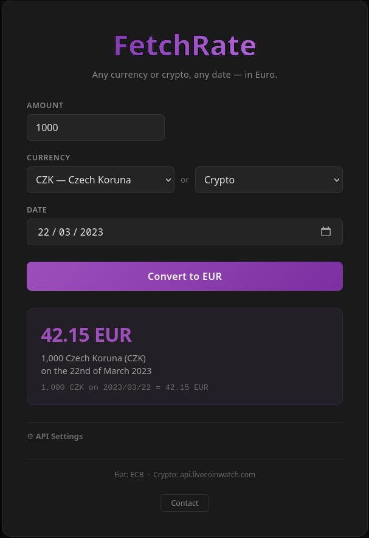

## FetchRate

v0.3

FetchRate converts a given amount of any currency or cryptocurrency into Euro on a specified historical date.
It provides three interfaces for the same service: a CLI, a REST API, and a web UI.

### Input / Output

The service takes three parameters:

| Parameter | Description |
|---|---|
| `amount` | The amount to convert |
| `currency` | ISO currency symbol or crypto ticker (e.g. `USD`, `BTC`) |
| `date` | Date in `YYYY-MM-DD` format |

And returns a JSON response:

```json
{
    "input": {
        "amount": "100",
        "currencySymbol": "USD",
        "date": "2024-01-15"
    },
    "output": {
        "inEuro": "92.50"
    }
}
```

---

### Building & Running

**Requirements:** Java 17+, Maven 4

Build the JAR:
```bash
mvn package -DskipTests
```

**CLI:**
```bash
java -jar target/FetchRate-0.3.jar convert --amount 100 --input-currency USD --date 2024-01-15

# Short flags are also supported:
java -jar target/FetchRate-0.3.jar convert -a 100 -c USD -d 2024-01-15
```

**HTTP server** (web UI at `http://localhost:8000`, REST API at `/convert`):
```bash
java -jar target/FetchRate-0.3.jar start_http_server

# Custom port:
java -jar target/FetchRate-0.3.jar start_http_server --port 9090
```

> The HTTP server binds to `127.0.0.1` (loopback only) by default. To expose it on the network — for example behind a reverse proxy — set `server.address=0.0.0.0` in `fetchrate.properties`.

For a full list of commands and options:
```bash
java -jar target/FetchRate-0.3.jar --help
```

---

### Interfaces

#### CLI

```
convert -a <amount> -c <symbol> -d <YYYY-MM-DD>
```

Prints the JSON result to stdout. Errors are also returned as JSON.

#### HTTP API

```
GET /convert?amount=<n>&input_currency=<symbol>&date=<YYYY-MM-DD>
```

Returns the JSON response on success. Returns an `error` field with an appropriate HTTP status on failure.

```
GET /health
```

Returns `{"status": "ok"}`.

#### Web UI

Once the HTTP server is started, a browser interface is available at `/`.

<p align="center">
  
</p>

---

### Database & Updates

The application maintains a local SQLite database in the `data/` directory for fast responses.

#### Automatic Updates

Rates are refreshed once per day on the first request of the day:

- **Fiat currencies** — fetched from the [European Central Bank](https://www.ecb.europa.eu). The appropriate feed is selected automatically: full history, 90-day, or daily, based on how long ago the database was last updated.
- **Cryptocurrencies** — if an API key is configured, the last 30 days of rates are fetched for the tracked symbol list (default: BTC, ETH, LTC, DOGE, SOL, USDT — see [Tracked Symbols](#tracked-symbols) below). Fiat and crypto updates are independent; a failure in one does not prevent the other from completing.

If both sources fail (e.g. no network), the daily timestamp is not updated so that the next request retries.

#### On-Demand Fetching

If a crypto rate for the requested date is not in the database, the application attempts to fetch it immediately via the API before returning an error. The result is stored for future use.

#### CSV Fallback

Place `.csv` files in `data/crypto/` to seed historical crypto rates without using API credits.
The filename should match the coin symbol (e.g. `BTC.csv`). The supported format is the export from [CoinCodex](https://coincodex.com/).

---

### Configuration

#### API Key

Three ways to provide a crypto data provider API key:

**Option 1 — Properties file (recommended):** create `fetchrate.properties` next to the jar:
```
fetchrate.api-key=your_api_key_here
```

**Option 2 — CLI:**
```bash
java -jar FetchRate-0.3.jar config --set-key your_api_key_here
java -jar FetchRate-0.3.jar config --set-url https://your-provider/endpoint
```

#### Tracked Symbols

The daily update fetches rates for a fixed default set: `BTC, ETH, LTC, DOGE, SOL, USDT`. You can customise this list:

```bash
java -jar FetchRate-0.3.jar config --list-symbols         # show current list
java -jar FetchRate-0.3.jar config --add-symbol XRP       # add a symbol
java -jar FetchRate-0.3.jar config --remove-symbol DOGE   # remove a symbol
```

The first add or remove seeds the default list first, so existing symbols are preserved. Any symbol supported by the configured data provider can be added. In HTTP mode the symbol list is also manageable from the web UI under **⚙ API Settings**.

**Option 3 — Environment variable:**
```bash
export FETCHRATE_API_KEY=your_api_key_here
```

When running in HTTP mode, the API key and provider URL can also be set via the web UI under **⚙ API Settings**.

> **CLI vs HTTP settings:** The `config` command (Options 1 and 2) writes values to `fetchrate.properties` and they take effect on the next startup. The web UI (HTTP mode) stores values in the local database and they take effect immediately without a restart. If both are configured, the database value takes priority. Avoid mixing the two for the same setting.

The crypto CSV directory defaults to `data/crypto` and can be overridden with the `fetchrate.crypto-dir` property.

---

## License
Copyright (c) 2026 Simon D. All rights reserved.
No permission is granted to use, copy, modify, or distribute this project without a written license.

For licensing inquiries, contact: simon.d.dev@proton.me
